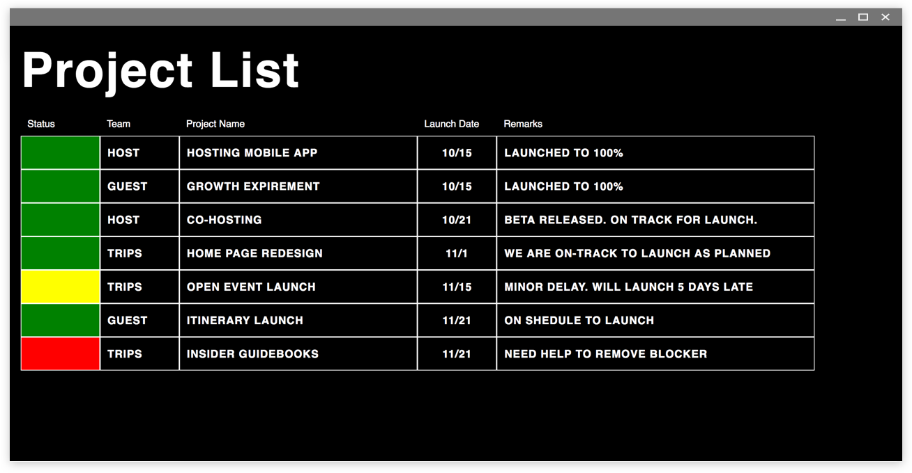

# Project Dashboard

## Introduction
This simple interface allows you to display your google sheets project list in a train-station bulletin view. It uses tabletop.js to interact with Google Sheets, and a little plain Javascript to display. The content reloads every 30 seconds. 

Design is a work in progress.

